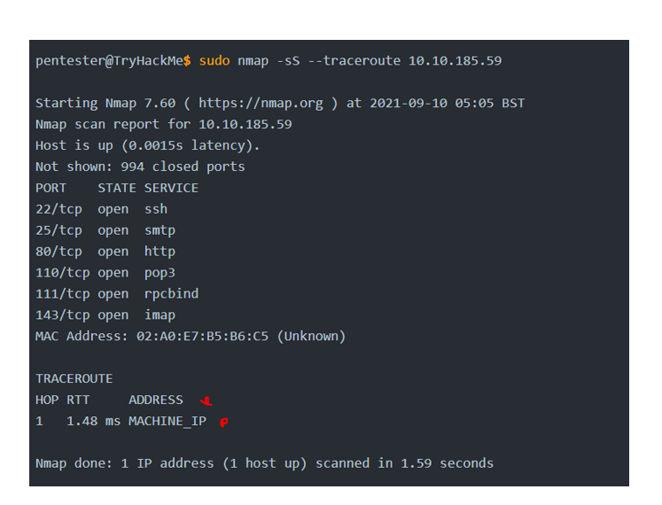

# IT-sikkerheds produktside

På denne side vil der blive fremlagt nogle af de mest centrale produktrelaterede resultater,  
som jeg har opnået i løbet af semesteret.

Hertil skal det nævnes, at der vil tages udgangspunkt i de resultater jeg har opnået undervejs i mit TryHackMe kursus.  
Kurset er opbygget således, at man får noget teori man læser igennem, og derefter skal man prøve nogle eksempler i praksis,  
så man får en forståelse for, hvad teorien kan bruges til.  

Der vil altså ikke blive brugt direkte eksempler, som relaterer sig direkte til det produkt, der skulle laves til virksomheden Megahard.  
Dette er grundet, at det It-sikkerhed med penetration testing som kurset har drejet sig om, hovedsagligt har været websites som angrebsmål.  
Da jeg ikke har stået for at skulle lave hjemmeside i gruppen, men derimod en app i mit andet emne, så har det været lidt svært med tiden at få det til at passe.

Eksemplerne der vil blive gennemgået er kun en lille del af det samlede læringsprodukt, som består af over 300 siders samlet teori og øvelser. Dette ville kunne ses ved at gå tilbage, og trykke ind på "TryHackMe - JR Penetration Tester", hvor man videreføres til et google docs. Eksemplerne vil ydermere kun bestå af de endelige resultater for hvert emne i kurset, og ikke rigtig selve teorien og selve udførelsen af øvelserne, da dette kan ses i google docs dokumentet. Da jeg også gerne vil forkorte det til noget som ikke tager en evighed at læse, så vil der til nogle af emnerne ikke være eksempler for alt hvad jeg har lavet.

# Introduction to webhacking - Første hovedmodul

Kurset begyndte for alvor først med dette emne.  

Det startede med "walking an applikation", hvor man skulle bruge developer tools i browseren til at bryde igennem html og css.  

  

Dertil blev de forskellige værktøjer i developer tools gennemgået, som omhandlede:
- Inspector
- Debugger
- Network

Dernæst var det "Content Disovery", som omhandler hvilke måder man kan indhente informationer omkring et website på.  

Her var det lige fra at tilgå hjemmeside paths, som burde være lukket ned fra udviklerens side:
 

Og derudover at bruge favicons(hjemmeside url logoer) til at indhente informationer omkring framework:
  

Derudover prøvede man også at sende requests afsted til hjemmesiden, hvor man kunne få informationer omkring serveren osv:

Derudover kunne der også gemme sig kommentarer, der burde være slettet, når man kigger på en hjemmesides page source:

Hvor man tilgik framework hjemmesiden og indsamlede informationer omkring login i dette tilfælde:

Som i dette tilfælde kunne bruges til noget login på den hjemmeside der bruger frameworket:

Eksemplet med at have så dårligt et login system er dog nok ikke så mange der bruger i den virkelige verden.  

Dernæst blev der gennemgået en masse automatiserende processer, blandt andet hvor man bruger wordlists der f.eks indeholder kodeord,  
som man kan prøve af automatisk, i stedet for at skulle taste det ind manuelt:

Der blev anvendt noget der hedder FFUF:
  
Her prøver man en wordlist af på en hjemmesides mange directories:  

Dernæst var det næste undermodul, som omhandlede "Subdomain Enumeration"  
Afsnittet omhandler, at man skal prøve at finde subdomæner til en hjemmeside.  
Her blev der brugt metoder som Brute Force, OSINT og Virtual host.

Brute Force:  

OSINT - Sublist3r:  

Næste underemne består af Authentication Bypass

Emnet omhandler hvordan man et websites authentication kan blive brudt.

Man starter med at finde brugernavne, ved at indtaste brugernavne på en hjemmeside, som så derefter typisk vil fortælle, om det pågældende brugernavn eksisterer.  

De fundne brugernavne gemmes i et dokument til senere.

Herefter udfører man automatiserede brute force angreb med brugernavne listen, samt med en liste med almindelige brugte kodeord.  
  

Dette er kun et af forskellige eksempler på authentication bypass. i google docs kan der også ses eksempler med at man lavet reset på et password,  
samt hvordan man manipulere med cookies, for at logge ind.  

Næste underemne er IDOR
IDOR står for Insecure Direct Object Reference, og er når man fra client side beder om nogle filer, data eller dokumenter, men der bliver ikke  
sikkerhedschekket fra server siden af, så man ved ikke om filerne tilhører brugeren.  

Et eksempel jeg har gennemgået til dette emne er f.eks at man har en lignende url:  
online-service.thm/profile?user_id=1305   
Her kan man se nogle data om en bruger der har et id på 1305.  
Men hvis man ændrer i url, så der f.eks står 1000 i stedet, så vil man se informationer omkring en bruger med id på 1000.  
Dette er et IDOR brud. Derudover fremgår der flere eksempler hvor værdien er hashed og meget mere i google docs.  

Hertil har jeg et lille praktisk eksempel, som jeg selv lavede med IDOR:   
  
Her brugte jeg bare developer tools i browser til at lave IDOR, da det var et eksempel, hvor der i url ikke var mulighed for at ændre id.

Næste underemne er File Inclusion.

Generelt handler File Inclusion om, at man i nogle applikationer vil kunne hente filer osv. Men Dette kan udnyttes ved at bruge "path traversal",  
hvor man gå tilbage i diretories med ../  
  
  

Bedste eksempel på at vise det med følgende:  
  
Man går tilbage i path 4 gange med ../, så man til sidst befinder sig i / folderen. Derefter er der skrevet /etc/passwd, for at kunne tilgå en passwd filen, som gerne skulle indeholde nogle kodeord til forskellige brugere.  

Dette er det primære eksempel jeg har arbejdet med, og derudover har jeg arbejdet med forskellige måder der bliver input valideret, og hvordan man kan bryde dette,  
og dermed stadig lave File Inclusion.  

Et enkelt eksempel på dette kunne være task 5 - lab 3 ved file inclusion.  
Her fortæller en error, at filen skal være en .php type fil, hvor jeg så prøver at ombryde denne input validering:  
  

næste underemne er SSRF.  
SSRF står for Server-Side Request Forgery.  
Angrebet omhandler at man sender request til en server.  
Her kan der være to typer angreb:   
-	data bliver returneret til hackeren.
-	Blind SSRF - angrebet foregår, men det bliver ikke returneret noget til hackeren.

Uden at gå for meget i dybden SSRF, så vil jeg bare vise et eksempel for det. Resten kan selvfølgelig læses i google docset.  
  
  
Her ender jeg ud med at bruge directory traversal fra forrige underemne til at jeg rent faktisk udfører en SSRF angreb.  
Hvis man kigger i page source efterfølgende, så vil informationer fra path /private være lagt ind "encoded" i base64 format, og man har dermed lavet  
et request af noget data, som man ikke burde have adgang til.  

Næste underemne er Cross-Site Scripting  
Her handler det om, at man gerne vil have lagt et javascript script over på en anden computer, hvor det så bliver executet, og udfører et eller andet.  
I de eksempler jeg har arbejdet med har man bare brugt XSS payload script, som laver en pop up box med alert:  

  
Men det kan også være farlige scripts, som f.eks at man stjæler login tokens gennem cookies:
  
Eller en keylogger, som onfanger alt hvad en bruger indtaster gennem deres keyboard på deres pc:  
  

Her er der forskellige typer XSS. Den første er reflected XSS.  
Her sender "hackeren" et link til en hjemmeside, hvor der indgår et script, som bliver executet lige så snart en bruger trykker på linket, og tilgår hjemmesiden.  

Derudover er der Stored XSS.  
Her gemmer "hackeren" scriptet på en hjemmesides database, og når andre bruger tilgår hjemmesiden, og data fra databasen hentes, så kan scriptet blive executet.  

Derudover er der DOM Based XSS.  
Her vil der være et link på en hjemmeside, som en bruger uskyldigt tror er et link til noget andet, men i stedet for bliver brugeren videreført til "hackerens" hjemmeside, hvor scriptet bliver executet.  

Til sidst er der Blind XSS, som er det samme som Stored XSS, bortset fra, at man ikke kan se sit payload script blive executet.  

Hertil har jeg udført nogle exercises, hvor jeg udfører disse XSS angreb.  
Her er et par eksempler:  
I begge eksempler prøver jeg at bryde uden om den input validering der er.  

  

Dette er kun 2 ud af 6 eksempler.  
Derudover er der også lavet en øvelse med blind XSS.  

Næste underemne er Command injection.  
Generelt omhandler det hvordan man kan indsætte commands på en hjemmeside, som så blive executet på en brugers pc.  
Command Injection fungere dog kun, hvis man bruger en applikation som udfører commands på en pc, f.eks "grep" til at søge efter filer.  
Hvis applikationen derfor er lavet uden input validering, så vil man kunne bytte commanden ud med en anden command.  

Et praktisk eksempel på brugen af Command Injection er den øvelse jeg lavede til:  

  
Her executer man altså whoami på pc.  
Eksemplet gør ikke brug af input validering, da jeg bare kan skrive hvilken som helst command ind. Man kan derfor sikre meget af sin applikation ved blot at lave god input validering.  

Sidste underemne er SQL injection.  
Dette emne har jeg arbejdet med mange gange før under uddannelsen, men da det var en del af kurset, så gennemførte jeg det stadig som en slags genopfriskning.  
SQL injection er når man executer usikre queries til sin SQL database, hvor man som "hacker" kan udføre alle former for ingreb med SQL sprog, hvis der ikke er  
god input validering.  

Første eksempel er et In-Band Sql-injection, der betyder, at man f.eks opdager en SQL injection usikkerhed på en side, og dermed også kan hente data ud fra SQL databasen på samme side ved at bruge SQL injections.  

  

Derudover er der Blind SQL injection. Her er der tale om, at man ikke får nogle error message, så man ikke ved om der er SQL injection eller ej. Men hvis man udfører  
en SQL injection som virker, så vil man selvfølgelig få det at se.  
  

Derudover er der mange andre eksempler på disse typer SQL injections i google docs dokumentet.  

# Burp Suite - Andet hovedmodul  

Andet hovedmodul bestod af brugen af værktøjet Burp Suite, som bruges til at opfange requests fra webservere.  
Jeg vil kort komme ind på hvordan værktøjet bruges i en webbrowser, og hvilke funktionaliter der kan bruges, der bliver vist gennem nogle øvelser.  
Brup suite funktionaliteter:
- Repeater
- Intruder
- Decoder
- Comparer

Først og fremmest skal man installere programmet, og derefter aktivere man den i sin browser
  
Man tilføjer altså her sin Burp suite proxy, så når den er aktiv, så vil den opsnappe alle requests man tilgår på sin browser.  
  

Herefter opsnapper man en request gennem proxy tab i sit burp suite, som man kan manipulere.  

  

derudover en opgave jeg lavede, som viser brugen af Burp suite.  
Her har man opsnappet en POST request, hvor der bliver ændret i en parameter, så man lægger et script ind istedet.  
  

Nu vil der kigges på de andre funktionaliter. Eksemplere vil kun være en lille del af de samlede opgaver jeg har været igennem, og kan selvfølgelig ses i google docs.  

Dernæst tages der et kig på Repeater:  
Repeater bruges, når man har et request der skal køres igennem mange gange med nogle få ændringer hver gang.  
Det kunne f.eks være følgende url:  
  
Hvor man vil ændre input fra "1" til forskellige ting, for at se hvilket respons man får tilbage.  
Der kunne f.eks gemme sig en SQl injection usikkerhed, hvis man indtaster ' og får en error 500 tilbage:  
  

Dernæst tages der et kig på Intruder:  
Intruder er en form for automatiseret udgave af Repeater.  Her vil man anvende nogle ordlister med f.eks kodeord, og så vil Intruder automatisk udskifte et ord i request, med et ord ad gangen for ordlisten.  

Derudover er der også forskellige angreb, som Intruder kan bruge, som er Sniper, Battering Ram, Pitchfork og Cluster bomb.  
Beskrivelser og eksempler på dem står i google docs.  
Jeg vil anvende et enkelt eksempel, for at vise intruder. Angrebet er pitchfork:  
Pitchfork er når man automatisere flere positioner samtidig. Man kan også sige, at man har flere snipers kørende samtidig, da sniper kun er en position.  
Man har sin request:  
  

Man lægger sine ordlister ind, hvilket er to i dette tilfælde, da der er to positioner som skal tjekkes.  
  
Herefter bliver der kørt en masse requests igennem, og man skal her holde øje med succes koden 200. Dermed ved man, at det var et succesfuldt login.  
Hvis ikke man får 200, men derimod 302, så må man kigge på respons length, da et succesfuldt resultat vil være kortere.  

Dernæst et kig på de sidste 3 funktionaliter.  

Decoder:  
Kan bruges til at decode noget data til et andet format, eller encode det til et andet format.  
Et eksemple kunne være følgende:  
  

Comparer:  
Giver mulighed for at sammenligne to stykke data.  
Et eksempel kunne være to requests man sammenligner fra intruder af, hvor man har et succesfuldt respons, og et ikke succesfuldt respons. Dermed kan man hurtigt få øje på forskellene:  
  

Sequencer:  
Kigger på randomness ved session cookies eller CSRF tokens der beskytter en "form submission".  
Hvis disse tokens ikke er genereret tilfældigt, så kan sequencer muligvis regne det ud.  
  
  

Derudover er det også noget som hedder "Extender", hvor man kan få ekstra funktionaliter, som er lavet af burp community. Dette vil jeg dog  
ikke gå i dybden med, da der er meget forskelliget.  

# Network Security - Tredje Hovedmodul
Først og fremmest kommer jeg ind på en del teori omkring passive Reconnaissance og active Reconnaissance.  
passive Reconnaissance er den "lovlige" måde at indhente informationer på, da man tilgår offentlig tilgængelige informationer uden at interagere direkte med en server osv.  
Active Reconnaissance er derimod når man interagere direkte med sine mål, hvilket er noget af der bliver kigget mest på i løbet af dette hovedmodul.  
Man skal dog passe på med Active Reconnaissance, da det er ulovligt at udføre disse "angreb", hvis man ikke er autoriseret til det.  

En stor del af de angreb jeg har lavet, har været med nmap command.  
Da forløbet var rimelig langt vil der kun blive vist de mest centrale resultater fra øvelser med commanden.  

Først skal man finde sine forskellige mål med nmap.  

  
Man bruger altså nmap til at finde 8 "mål"  
Man skal dog være opmærksom på, at der kan være forskel på hvilke scans man skal udføre, ud fra hvilke privileger man har som bruger.   
Hvis man er en root bruger, hvor man har alle privileger, samt at man skal lave scanning på et lokalt netværk(Ethernet), så kan man bruge ARP scan:  

  
Derimod hvis man laver scaninnger uden for det lokale netværk, så må man istedet f.eks anvende et echo request:  
  
Til aller sidst, så er der hvis man er en uprivilegeret bruger, så må man istedet bruge TCP 3-way handshake:  
  

Når man har fundet de forskellige livehosts/mål, så er det tid til at scanne efter åbne porte. Dette gøres med disse eksempler:  
For en ikke privilegeret bruger:  
  
For en privilegeret root bruger:  
  
Herved finder man altså åbne porte.  

Derudover er der nogle advancerede port scanninger. Igen så vil jeg kun tage nogle få eksempler, som jeg føler er vigtigst.  
Igen så handler alle scanningerne om, om portene er åbne eller ej.  
Først et null scan.  
  
Dernæst et TCP ACK scan:  
  
Derudover er der noget som hedder Spoofing, hvor man sender nogle packets til målets ip, som så redirecter et respons over til en spoofing ip, som "hackeren" har.  
Målet er selvfølgelig at man ikke vil opdages.  
  
Derudover er der Decoys, som er lidt det samme som spoofing, bortset fra at det ligner, at scanningen kommer fra mange flere ip adresser.  
  

Nu hvor man har fundet sine mål, samt har udført en række port scaninnger for at se hvilke porte der er åbne, så skal man gerne have et eller andet ud af det.  
Nogle af de ting man blandt kan tilføje til sine scanninger er:  
Service og version informationer omkring portene:  
  
Derudover kan man kigge på Operativ system informationer:  
  
Eller bruge Traceroute til at finde de routere der ligger mellem målet og ens egen ip adresse.  
  

Derudover indeholder nmap ved default omkring 600 scripts man kan bruge, og dermed skaffe ekstra informationer.  

Dernæst indeholder hovedforløbet også noget med protocoller og serverer.  

