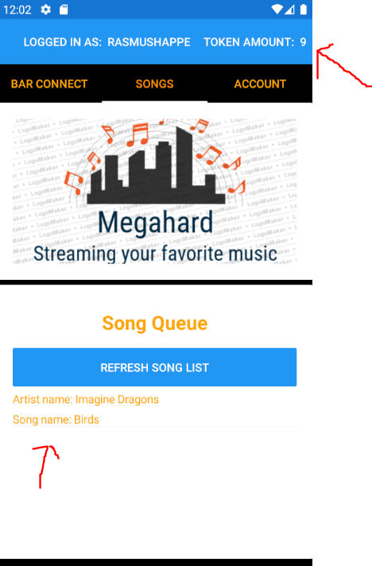
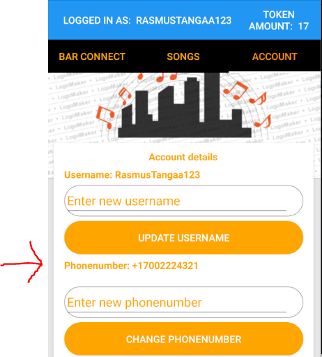

[Tilbage](https://rasmustangaa.github.io/4.semester-projekt/Xamarin/)  

Denne side kommer til at afdække selve produktet af den app, som jeg har procuderet i xamarin forms. Her har jeg testet produktet på android, da det fra start har været nemmest at koncentrere sig om android, samt at det har været lidt svært at få testet på IOS.  

# Opstart af projekt, samt krav til app

Ideen med projektet startede med et medlem af gruppen, Malik Bonnicksen, som sammen med PO for den nystartede virksomhed Megahard fremlagde projektet:  
  
  
  
  

Hertil har jeg som beskrevet designet en app, som ligesom billedet viser, forbundet til en raspberrypy server, hvortil der kan hentes en playliste ned, og der kan oploades sange til playlisten.  
Undervejs vil jeg beskrive hvordan jeg sætter den færdige server op, så jeg kan bruge den til mit behov, nemlig at forbinde til min app.  
Serveren er lavet således, at den er forbundet til spotify, hvor det kræves, at man har spotify premium, hvis man gerne vil lægge sange op i Queue gennem serveren, som bruger en spotify api. At hente playlisten ned kræver derimod ikke spotify premium.  

# Brug af raspberryPy server til appen

På min PC har jeg en mappe med hele projektet af RaspberryPy, som har python som sprog. Dette har jeg hentet fra Maliks github.  
For at starte serveren laver jeg en git bash på mappen, hvor jeg starten serveren med følgende:  
  
Når man så lægger en sang i køen til appen, så sørger serveren for at ændre køen af sange på den spotify premium konto der er forbundet.

# MVVM start - Model

Selve min app er bygget op efter MVVM arkitekturen, hvilket betyder at man har Models - Views - Viewmodels. 
Models står for at lagre alt business logikken og data for de objekter der er relevant i forhold til de user stories som PO har opsat for at projektet bliver en succes.  
Et eksempel kunne være en "User":  
  

# Viewmodel(MVVM)

Dertil er der Viewmodels, som bindeleddet mellem View og models, samt de services, som jeg bruger i projektet til f.eks at forbinde til raspberryPy serveren.  
Et eksempel kunne være den viewmodel jeg kalder "AccountViewModel", som styrer alt der er relevant for at dataen fra en bruger bliver retmæssigt præsenteret i de views, som viser Brugerens account. Her er nogle små udsnip af viewmodellen, som viser brugen af en User property med inotifychanged event, samt async metoder, der forbinder til en service, og henter en bruger og opdatere en bruger:  
  
  

# View(MVVM)

Herefter er der Views, som er det sidste led, og som sørger for at man har en god brugergrænseflade, som slutbrugeren kan kigge på og interagere med.  
Disse views bruger Xaml til at lave designet med. Et eksempel kunne være:  
  
1. en klassisk xaml binding, hvor man binder til property "CurrentUser" fra den viewmodel som jeg viste tidligere.  
2. en command binding, som fungere lidt på samme måde, hvor man har en property i sin viewmodel af typen Icommand, som man så forbinder en metode til. Hertil kommer der et eksempel efter punkt 3.  
3. Da det er en tabbedPage jeg viser her i it view, så fungere det ligesom en liste af view man kan trykke på. Her er "SongPage" f.eks en helt view i sig selv, som vises, når man trykker på den i sin tabbedPage. Dette var kun et af mange eksempler på et view.  

# Brugen af ICommand

Hertil et eksempel på brugen af Icommand, med en forbundet metode til:  
Først selve property for Commanden:  
  
Herefter tilskriver man Command property til en bestemt metode.
  
Hvor metoden også ligger i Viewmodel, og er faktisk en metode som allerede er vist længere oppe i form af "UpdateUserAsync".  

Efter denne korte gennemgang af MVVM arkitekturen til min app, så tænker jeg at jeg vil vise nogle af de funktionaliter, som gør sig gældende i den app jeg har lavet. 

# De generelle funktionaliter i appen  

Generelt er funktionaliterne:  
- Login side med email og kodeord
- Registerings side med email, kodeord, brugernavn og mobilnummer. Her fungere mobilnummeret som en validering af kontoen, da brugeren får et godkendelses besked tilsendt, hvor man så indtaster en kode i appen.  
- en konto side, hvor man kan ændre nogle af sine kontooplysninger. f.eks brugernavn.  
- En side hvor man kan se den nuværende playliste med de sangnumre der kan afspilles.  
- en side hvor man kan forbinde til en bar, og derefter vælge en sang der skal indsættes i playlisten mod betaling af 1 token.  
- en side til at lægge flere tokens ind.  

# kort forklaring af firebase authentication database og NoSQL til login/registering-siderne  

Jeg vil starte med at vise login og registrerings siden, hvor jeg til dette formål har bruge googles firebase. Her er der en authentication database med brugerens email og kodeord, som jeg har forbundet med deres realtime database til at oplagre data om brugeren som mobilnummer og brugernavn. Databasen gør brug af NoSql, hvilket er en forandring i forhold til tidligere semestre. I NoSQl har man en hel del mere fleksibilitet, da man kan gemme en hel masse ustruktureret data. Ulempen er selvfølgelig, at det kan være svært at navigere i, hvis man har meget forskelligt data. I mit tilfælde har det dog kun været bruger informationer, da jeg kun har brugt det til login authentication. Det vil sige, at det kun har været en type data, i stedet for mange forskellige tables med data.  

# Login side til app

Først login siden:  
  
På siden har man mulighed for at indtaste email og kodeord.  Ting som "Remember me" og "Forgot password" er dog ikke implementeret, da jeg ikke har vurderet det så højt.  
Derudover kan man trykke på "Sign in", når man har tastet de rigtige login oplysninger, samt trykke på "Sign Up", hvis man ikke har en konto.  

# Registeringsside til app

Herefter Registeringssiden:  
  
På denne side taster man oplysninger ind i de 4 felter. Når man har gjort det, så kan man bede om en validerings sms, hvor man så taster den kode ind, som man har modtaget på sin mobil nummeret tilhører.  
Herefter er man registeret. Disse ting vises på billederne nedenunder:  
  
Man trykker altså på "Send Verification sms", hvortil at man får tilsendt en kode til det angivne nummer. Nummeret er et testnummer jeg anvender, hvor den faste kode tilsendt er 123456.  
  
Herefter trykker man på "Verify code", hvortil at hvis koden passer, så bliver man registeret, samt automatisk logget ind.  

# Firebase database brug

For lige at vise mit brug af firebase hurtigt, så gør jeg først og fremmest brug af deres Authentication database:  
  
Hertil har jeg valgt authentication med henholdvis email og mobil nummer, da det var meningen at jeg ville godkende ved brug af email også. Fra PO's side var det dog vigtigst med mobil nummer, da folk har nemmere ved at udskifte en email, i forhold til et mobilnummer.  
  
Dertil har jeg også en Realtime Database forbundet fra firebase. Her er det kun "Users" table jeg bruger, hvor der på billedet kun er indsat en bruger.  
  
Generelt så har jeg anvendt firebase, da jeg gerne ville prøve noget nyt i forhold til database.  

# Sang kø/playliste

Dernæst til hovedfunktionaliteterne i appen:  
Først er der "Songs" tabben, som åbner siden man kan se på billedet nedenunder.  
  
Hele formålet med denne side er, at man skal kunne se en liste med de sange der er i queue på den pågældende bar. Jeg har dog kun mulighed for at teste appen med den python server, som jeg har sat op tidligere. Hvis det var ude i den virkelige verden, og man havde mange barer, så skulle hver bar have en server der kunne forbindes til. Det ser således ud, når der ligger en sang i queue:  
  
Selve designet kunne selvfølgelig være pænere, men min hovedprioritet har været at få funktionaliteten i appen til at virke.  

# Forbind til bar og sæt sang i kø/playliste

Dernæst er der tabben til venstre, som jeg har kaldt "Bar Connect", som åbner en side hvor man "forbinder" til en bar, og derefter kan vælge at lægge en sang i queue mod betaling af tokens.  
  
Man vælger her en bar, og Trykker herefter på knappen "Connect To Bar"  
  
Når det er gjort, kan man se hvilken bar man er forbundet til, og herefter kan man vælge en sang der skal sættes i queue.  
  
Når man har sat en sang i queue, så kan man gå over til "Songs" tabben igen, og se at sangen er sat i queue:  
  
Derudover kan man se, at ens "Token Amount" er gået fra 10 til 9, da det koster 1 token, at sætte en sang i queue. 

Udover dette så er der siden til at ændre login oplysninger. Generelt er der ikke så meget specielt over den, udover at man kan ændre ting som Brugernavn, mobilnummer, Email, samt ens adgangskode. Hertil laver jeg lige en hurtig gennemgang af de forskellige punkter:  

# Brugernavn ændring  

Brugernavn:  
Siden her viser "Account" siden, og her har jeg indtastet et nyt brugernavn "RasmusTangaa123" i feltet. Hele siden er lavet som en side man kan scrolle på.  
  
Herefter trykker man på "Update Username" knappen, hvortil brugernavnet opdateres:  
  

# Mobilnummer ændring  

Mobilnummer:  
Hertil indtaster jeg et nyt mobilnummer, og trykker på knappen "Change Phonenumber".  
  
Hertil ændres designet en smule, hvor man får et felt til at indtaste en kode i, samt en ny knap, hvor man kan verificere den indtastede kode. Koden er sendt til det indtastede nummer:  
  
Herefter skal man logge ind igen, hvilket primært var grundet nogle problemer med firebase der gjorde, at dette var nødvendigt.  
  
Nu kan man se, at mobilnummeret er opdateret.  

# Email ændring  

Email:  
Man indtaster en ny email, og trykker derefter på knappen "Update Email":  
  
Herefter skal man indtaste sin adgangskode for at verificere ændring af email. Grunden til at der bruges til ekstra verificering på mobilnummer og email er fordi, at  
de bruges til at godkende selve brugeren med.  
  
Herefter er emailen opdateret:  
  

# Adgangskode ændring  
Adgangskode:  
Til sidst er der ændring af adgangskode. Derudover er der selvfølgelig også "Log Out" knappen, som man bare kan trykke på, hvis man vil logges ud.  
  
Man indtaster sin gamle adgangskode, samt den nye adgangskode:  
  
Herefter trykkes der på knappen, og hvis den gamle adgangskode er rigtig, og den nye adgangskode følger de generelle regler for adgangskode format, så ændres den.  
  
Hertil en lille pop up boks, der fortæller, at adgangskoden er ændret. Disse pop up bokse er der for hver gang man har ændret noget, eller der sker en fejl når man ændrer noget. Man da jeg gerne ville korte selve produktsiden lidt ned, så undlod jeg de fleste af dem, og viste i stedet denne.  

# Token side
Til sidst kan siden, hvor man kan lægge flere tokens ind vises.  
Her trykker man på "Token Amount: 9", som pilen på forrige billede pegede på. Herefter kommer man til følgende side:  
  
På siden kan man med en slider bestemme en antal tokens man vil købe. Her har jeg dog sat maks til 10, men det kunne være hvilket som helst nummer.  
Herefter kan man se total prisen på tokens, hvorefter man kan trykke på knappen "Buy 5 Tokens" i dette tilfælde, hvor man har valgt 5 med slideren:  
  
Herefter kan man trykke på "Go Back" knappen, og se at man nu har 14 tokens i stedet for 9:  
  

I princippet var det meningen at der skulle kunne kobles en form for betalingsystem til at kunne købe disse tokens, men det er lige umiddelbart uden for min rækkevidde. Jeg overvejede at lave mit eget lille betalingssystem til, men vurderede, at det nok ikke var tiden værd.  

Dette var alt for min app.  

