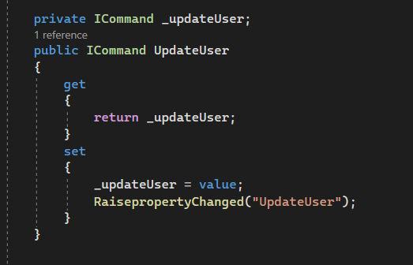

[Tilbage](https://rasmustangaa.github.io/4.semester-projekt/Xamarin/)  

Denne side kommer til at afdække selve produktet af den app, som jeg har procuderet i xamarin forms. Her har jeg testet produktet på android, da det fra start har været nemmest at koncentrere sig om android, samt at det har været lidt svært at få testet på IOS.  

Ideen med projektet startede med et medlem af gruppen, Malik Bonnicksen, som sammen med PO for den nystartede virksomhed Megahard fremlagde projektet:  
  
  
  
  

Hertil har jeg som beskrevet designet en app, som ligesom billedet viser, forbindet til en raspberrypy server, hvortil der kan hentes en playliste ned, og der kan oploades sange til playlisten.  
Undervejs vil jeg beskrive hvordan jeg sætter den færdige server op, så jeg kan bruge den til mit behov, nemlig at forbinde til min app.  
Serveren er lavet således, at den er forbundet til spotify, hvor det kræves, at man har spotify premium, hvis man gerne vil lægge sange op i Queue gennem serveren, som bruger en spotify api. At hente playlisten ned kræver derimod ikke spotify premium.  

På min PC har jeg en mappe med hele projektet af RaspberryPy, som har python som sprog. Dette har jeg hentet fra Maliks github.  
For at starte serveren laver jeg en git bash på mappen, hvor jeg starten serveren med følgende:  
  

Selve min app er bygget op efter MVVM arkitekturen, hvilket betyder at man har Models - Views - Viewmodels. 
Models står for at lagre alt business logikken og data for de objekter der er relevant i forhold til de user stories som PO har opsat for at projektet bliver en succes.  
Et eksempel kunne være en "User":  
  

Dertil er der Viewmodels, som bindeleddet mellem View og models, samt de services, som jeg bruger i projektet til f.eks at forbinde til raspberryPy serveren.  
Et eksempel kunne være den viewmodel jeg kalder "AccountViewModel", som styrer alt der er relevant for at dataen fra en bruger bliver retmæssigt præsenteret i de views, som viser Brugerens account. Her er nogle små udsnip af viewmodellen, som viser brugen af en User property med inotifychanged event, samt async metoder, der forbinder til en service, og henter en bruger og opdatere en bruger:  
  
  

Herefter er der Views, som er det sidste led, og som sørger for at man har en god brugergrænseflade, som slutbrugeren kan kigge på og interagere med.  
Disse views bruger Xaml til at lave designet med. Et eksempel kunne være:  
  
1. en klassisk xaml binding, hvor man binder til property "CurrentUser" fra den viewmodel som jeg viste tidligere.  
2. en command binding, som fungere lidt på samme måde, hvor man har en property i sin viewmodel af typen Icommand, som man så forbinder en metode til. Hertil kommer der et eksempel efter punkt 3.  
3. Da det er en tabbedPage jeg viser her i it view, så fungere det ligesom en liste af view man kan trykke på. Her er "SongPage" f.eks en helt view i sig selv, som vises, når man trykker på den i sin tabbedPage. Dette var kun et af mange eksempler på et view.  

Hertil et eksempel på brugen af Icommand, med en forbundet metode til:  
Først selve property for Commanden:  
  
Herefter tilskriver man Command property til en bestemt metode.
  
Hvor metoden også ligger i Viewmodel, og er faktisk en metode som allerede er vist længere oppe i form af "UpdateUserAsync".  

